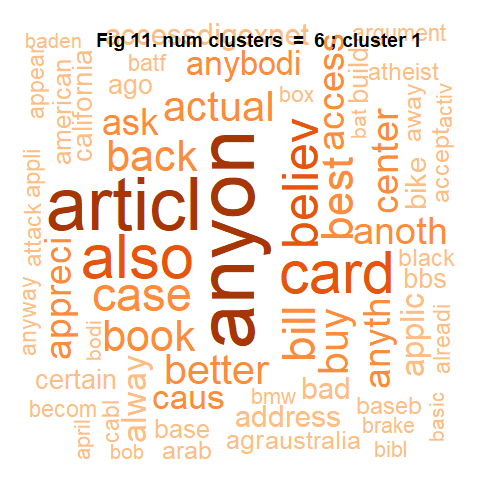

Analysis of Corpus in Text Documents
================
Akshay Kochhar - 18230051
March 10, 2019

**Introduction:**
-----------------

In the exploratory analysis (initially) of the data set, it was figured out that all the documents in the corpus are e-mail communications among people as it contains words like 'From', 'Subject', 'Organisation', 'To' and 'Lines' frequently. As these words do not add to the final result of analysis, these are removed from the text data.

Fulfilling the task of informing data scientists, I would like to mention that the given corpus was divided into 21 small sub-corpus namely - corps\_1, corps\_2, corps\_3, corps\_4, corps\_5, corps\_6, corps\_7, corps\_8, corps\_9, corps\_10, corps\_11, corps\_12, corps\_13, corps\_14, corps\_15, corps\_16, corps\_17, corps\_18, corps\_19, corps\_20 and corps\_21 (having equal number of documents in each sub-corpus). The documents are divided using document ids, for instance, corps\_1 contains documents from 1 to 340.

The approach followed for this assignment is as follows:

1.  Uploading, cleaning, transforming corpus text, and creating sample for further analysis.
2.  Exploratory analysis using K-means clustering.
3.  Visualizing results obtained from K-means.
4.  Exploratory analysis using hierarchical clustering.
5.  Visualizing results obtained from hierarchical clustering.
6.  Additional Visualization.

**Deliverables:**
-----------------

### **Deliverable 1: Data Processing**

This step includes removing special characters, stopwords, converting all the words to lowercase, removing punctuations and stemming the text. As mentioned earlier, the words like 'From', 'Subject', 'Organisation', 'To' and 'Lines' were removed from the text by considering them as stop words, and at last a sample of 30% is taken for further processing.

#### **1.1 Installing and loading all the required packages**

``` r
#loading

library(tm)
library(SnowballC)
library(wordcloud)
library(RColorBrewer)
library(dplyr)
library(ggplot2)
library(ggdendro)
library(cluster)
library(HSAUR)
library(fpc)
library(skmeans)
library(plyr)
library(distances)
library(philentropy)
library(dplyr)
library(networkD3)
library(ape)
library(gplots)
library(stats)
library(ggfittext)
library(treemapify)
library(dendextend)
library(circlize)
library(ggwordcloud)
```

#### **1.2 Loading the corpus into R**

``` r
#classic <- VCorpus(DirSource("corpus",encoding = "UTF-8"), readerControl = list(language = "eng"))
```

#### **1.3 Clean and transform the data**

``` r
#Cleaning the data by removing certain characters

toSpace <- content_transformer(function (x , pattern) gsub(pattern, " ", x))

classic <- tm_map(classic, toSpace, "/")
classic <- tm_map(classic, toSpace, "/.")
classic <- tm_map(classic, toSpace, "@")
classic <- tm_map(classic, toSpace, "\\|")

# transforming the text 

# Convert the text to lower case
classic <- tm_map(classic, content_transformer(tolower))

# Remove english common stopwords
classic <- tm_map(classic, removeWords, stopwords("english"))

# Remove punctuations
classic <- tm_map(classic, removePunctuation)

# Remove numbers
classic <- tm_map(classic, removeNumbers)

# remove single characters
classic <- tm_map(classic, removeWords, c(letters)) 

# Eliminate extra white spaces
classic <- tm_map(classic, stripWhitespace)

# Text stemming 
classic <- tm_map(classic, stemDocument)

# Remove words which are frequent and add no meaning
classic <- tm_map(classic, removeWords, c('From', 'Subject', 'Organisation', 'To', 'Lines', 'Distribution', 'can'))
```

#### **1.4 Preparing the sample for further analysis**

``` r
# Preparing document-term matrix
classic.dtm <- DocumentTermMatrix(classic, control = list(weighting = function(x) weightTfIdf(x, normalize = TRUE)))

# The sparsity matrix is taken as per tutorial
sparsity_threshold = 0.9995

# Removing Sparsity term
classic.dtm <- removeSparseTerms(classic.dtm, sparsity_threshold)

# Creating term document matrix
classic.dtm.mat <- classic.dtm %>% as.matrix()

# remove any zero rows
classic.dtm.mat <- classic.dtm.mat[rowSums(classic.dtm.mat^2) !=0, ]

#Randomly sample of 25 percentage of documents from the corpus
set.seed(99)
percent = 30
sample_size = nrow(classic.dtm.mat) * percent/100

classic.dtm.mat.sample <- classic.dtm.mat[sample(1:nrow(classic.dtm.mat), sample_size, replace=FALSE),]
```

### **Deliverable 2: Exploratory Analysis K-means clustering**

For further exploratory analysis, rather than taking arbitary 'k' value, I used K-means clustering (elbow method) to find the accurate number of clusters. In the elbow method, that value of k is chosen where before the point there is rapid decrease in sum of squared errors, and after that the decrease in SSE becomes constant. In the plot, it can be observed that there is a smooth curve for almost 20 clusters indicating that the data is not clustered and is evenly distributed.

Key-points:

1.  Even-though there has not been clear constant elbow curve, the value of k = 2 is chosen because it showed somewhat 'elbow' like shape.
2.  The cluster value 19 or beyond 20 was not chosen because the number of words per cluster would have decreased, and k-means clustering takes a lot of time to run.
3.  Since the line is smooth, i.e., the data is not clustered, we have to choose another clustering technique to get the count of clusters.
4.  Further in analysis, the documents are divided into sub-corpus to identify the number of documents present in each sub-corpus.

``` r
#a <- 0

#Using k-means to calculate k

#for (i in 1:20){
  #km.reslt <- kmeans(classic.dtm.mat.sample, i)
  #a[i] <- km.reslt$tot.withinss
  #}

#Plotting the values to check 'k'
ggplot()+
  geom_line(aes(x=1:20, y= a),linetype="solid", colour="blue")+
  geom_point(aes(x= 2, y= 1417), colour="red") +
  scale_x_continuous(breaks=seq(1,20,1)) +
  ggtitle("Fig 1. K-means clustering (Elbow Method)")+
  xlab("No. of Clusters (k)")+
  ylab("Sum of squared errors")+
  theme(
    axis.line = element_line(colour = "black", size = 0.25),  
    axis.text.x = element_text(hjust=1, vjust = .5), 
    plot.title = element_text(hjust = 0.5, face = "bold")
    )
```


``` r
#skmeans function returns a vector of cluster assignments
classic.dtm.mat.sample.skm <- skmeans(classic.dtm.mat.sample,3, method='pclust')

#convert the vector to a data frame and gave it meaningful column names
classic.dtm.mat.sample.skm <- as.data.frame(classic.dtm.mat.sample.skm$cluster)  

colnames(classic.dtm.mat.sample.skm) = c("cluster")

#rownames returns a list of the row names (which are the document names)
classic.dtm.mat.sample.skm$docs <- rownames(classic.dtm.mat.sample)

classic.dtm.mat.sample.skm$docs <-lapply(classic.dtm.mat.sample.skm$docs, function(x) gsub("doc", "", x))

classic.dtm.mat.sample.skm$docs <- unlist(classic.dtm.mat.sample.skm$docs)

# Dividing documents into sub-clusters and name them with different names.

z <- classic.dtm.mat.sample.skm$docs

classic.dtm.mat.sample.skm$docs <- as.numeric(z)

classic.dtm.mat.sample.skm <- classic.dtm.mat.sample.skm %>%  
  mutate(
    doc = case_when(
    .$docs >= 1 & .$docs <= 340 ~ "corps_1",
    .$docs >= 341 & .$docs <= 680 ~ "corps_2",
    .$docs >= 681 & .$docs <= 1020 ~ "corps_3",
    .$docs >= 1021 & .$docs <= 1360 ~ "corps_4",
    .$docs >= 1361 & .$docs <= 1700 ~ "corps_5",
    .$docs >= 1701 & .$docs <= 2040 ~ "corps_6",
    .$docs >= 2041 & .$docs <= 2380 ~ "corps_7",
    .$docs >= 2381 & .$docs <= 2720 ~ "corps_8",
    .$docs >= 2721 & .$docs <= 3060 ~ "corps_9",
    .$docs >= 3061 & .$docs <= 3400 ~ "corps_10",
    .$docs >= 3401 & .$docs <= 3740 ~ "corps_11",
    .$docs >= 3741 & .$docs <= 4080 ~ "corps_12",
    .$docs >= 4081 & .$docs <= 4420 ~ "corps_13",
    .$docs >= 4421 & .$docs <= 4760 ~ "corps_14",
    .$docs >= 4761 & .$docs <= 5100 ~ "corps_15",
    .$docs >= 5101 & .$docs <= 5440 ~ "corps_16",
    .$docs >= 5441 & .$docs <= 5780 ~ "corps_17",
    .$docs >= 5781 & .$docs <= 6120 ~ "corps_18",
    .$docs >= 6121 & .$docs <= 6460 ~ "corps_19",
    .$docs >= 6461 & .$docs <= 6800 ~ "corps_20",
    .$docs >= 6801 & .$docs <= 7142 ~ "corps_21"
)
)

classic.dtm.mat.sample.skm <- classic.dtm.mat.sample.skm[, -2]
classic.dtm.mat.sample.skm.table <-table(classic.dtm.mat.sample.skm$cluster, classic.dtm.mat.sample.skm$doc)
classic.dtm.mat.sample.skm.table <-as.data.frame.table(classic.dtm.mat.sample.skm.table)
```

#### **2.1 Statistics for Sub-corpus**

1.  In full data, the plot below gives the number of documents in each sub-corpus. All the sub-corpus except 'corps\_21' has equal number of documents.
2.  The 25% sample has at-most 120 documents in sub-corpus, and 'corpus-13' has 80 documents.

``` r
crps.list <- c("corps_1", "corps_2", "corps_3", "corps_4", "corps_5", "corps_6", "corps_7", "corps_8", "corps_9", "corps_10", "corps_11", "corps_12", "corps_13", "corps_14", "corps_15", "corps_16", "corps_17", "corps_18", "corps_19","corps_20","corps_21")

crps.doc.counts <- c((340), (680-340), (1020-680), (1360-1020), (1700-1360),(2040-1700), (2380-2040), (2720-2380), (3060-2720), (3400-3060), (3740-3400), (4080-3740), (4420-4080),(4760-4420), (5100-4760), (5440-5100), (5780-5440), (6120-5780), (6460-6120), (6800-6460),(7142-6800))

stat <- data.frame(crps= crps.list, cnt=crps.doc.counts)

# Plot showing the number of documents per sub-corpus in complete data set

ggplot(data=stat, aes(x= crps, y=cnt))+
  geom_bar(width = 0.7, stat="identity", color="black", fill = "#E88E04")+
  xlab("Sub-Corpus")+
  ylab("No. of Documents per sub-corpus")+
  ggtitle("Fig 2. Original Corpus Stats")+
  scale_y_continuous(expand = c(0, 0),breaks=seq(0,340,20)) +
  theme(
    panel.grid.major = element_blank(), 
    panel.background = element_blank(), 
    axis.line = element_line(colour = "black", size = 0.25),  
    axis.text.x = element_text(hjust=1, vjust = .5),
    plot.title = element_text(hjust = 0.5, face = "bold"),
    axis.title = element_text(color="black", face="bold", size=12))+
  coord_flip()
```


``` r
# Plot showing the number of documents per sub-corpus in 25% sample

dt <- classic.dtm.mat.sample.skm.table %>% 
  dplyr::group_by(Var2) %>%
  dplyr::summarise(Freq = sum(Freq))

h <- ggplot(dt, aes(x=Var2, y=Freq))+
  geom_bar(width = 0.7, stat="identity", color="black", fill = "#2A8CBD")+
  xlab("Sub-Corpus")+
  ylab("No. of Documents per sub-corpus")+
  ggtitle("Fig 3. 25% Sample Corpus Stats")+
  scale_y_continuous(expand = c(0, 0),breaks=seq(0,120,10)) +
  theme(
    panel.grid.major = element_blank(), 
    panel.background = element_blank(), 
    axis.line = element_line(colour = "black", size = 0.25),  
    axis.text.x = element_text(hjust=1, vjust = .5),
    plot.title = element_text(hjust = 0.5, face = "bold"),
    axis.title = element_text(color="black", face="bold", size=12))+
  coord_flip()

h
```


#### **2.2 Checking composition from K-means method**

In the below blocks, I have checked the composition of words in all the three clusters using stacked bar-chart and word cloud.

``` r
# plotting word cloud 

#Below method is not working. Some error is coming. I have to create sample with same seed value.
#classic.tdm.sample <- classic.tdm[, rownames(classic.dtm.mat.sample)] 

# Preparing document-term matrix
classic.tdm <- DocumentTermMatrix(classic, control = list(weighting = function(x) weightTfIdf(x)))

# The sparsity matrix is taken as per tutorial
sparsity_threshold = 0.9995

# Removing Sparsity term
classic.tdm.mat <- removeSparseTerms(classic.dtm, sparsity_threshold)

# select only the documents from the  random sample taken earlier
set.seed(99)  
percent = 30
sample_size_tdm = nrow(classic.tdm.mat) * percent/100

classic.tdm.sample <- classic.tdm.mat[sample(1:nrow(classic.tdm.mat), sample_size_tdm, replace=FALSE),]

# convert to r matrix
classic.tdm.sample.mat <- classic.tdm.sample %>% as.matrix()

m<- length(unique(classic.dtm.mat.sample.skm$cluster))

set.seed(2474)

par(mfrow=c(2,m))

# for each cluster plot an explanatory word cloud
for (i in 1:m) {
  
  
  #the documents in  cluster i
  cluster_doc_ids <-which(classic.dtm.mat.sample.skm$cluster==i)
  
  #the subset of the matrix with these documents
  classic.tdm.sample.mat.cluster<- classic.tdm.sample.mat[, cluster_doc_ids]
  
  # sort the terms by frequency for the documents in this cluster
  v <- sort(colSums(classic.tdm.sample.mat.cluster),decreasing=TRUE)
  
  d <- data.frame(word = names(v),freq=v)
  
  # call word cloud function
  wordcloud(words = d$word, freq = d$freq, scale=c(3,.1), min.freq = 1,
            max.words=200, random.order=FALSE, rot.per=0.35, 
            colors=brewer.pal(8, "Dark2"))
  title(paste("Fig 4. Cluster", i))

  # call bar plot function
  barplot(d[1:10,]$freq, las = 2, names.arg = d[1:10,]$word,
        col ="lightblue", main =paste("Fig 5. Most frequent words - Cluster ", i),
        ylab = "Word frequencies",width = 0.05)
  
}
```


``` r
#Stacked Bar Chart

# Define the number of colors to be filled in sub-groups
nb.cols <- 21
mycolors <- colorRampPalette(brewer.pal(8, "Set1"))(nb.cols)

# make a data frame table from it - suitable for plotting
#classic.dtm.mat.sample.skm.table <-as.data.frame.table(classic.dtm.mat.sample.skm.table)

# plot stacked bar graph to show cluster compositions
g<- ggplot(classic.dtm.mat.sample.skm.table, aes(x=Var1, y=Freq, fill=Var2))
g<- g + 
  geom_bar(width = 0.5, stat="identity") +
  scale_fill_manual(values = mycolors,name = "Document Classes") +
  scale_y_continuous(expand = c(0, 0),breaks=seq(0,1400,200)) +
  xlab("Cluster IDs") +
  ylab("Frequency") + 
  ggtitle("Fig 6. Cluster word compositions") +
  theme(
    plot.title = element_text(hjust = 0.5, size = 12,face="bold"),
    panel.grid.major = element_blank(), 
    panel.background = element_blank(), 
    axis.line = element_line(colour = "black", size = 0.25),  
    axis.text.x = element_text(hjust=1, vjust = .5), 
    legend.key = element_rect(fill = NA, colour = NA, size = 0.25)
    ) 

g
```


### Observations:

1.  All the three clusters contain mix words from various regions, and do not help in making an intelligent guess about the field/region of text.
2.  The K-means clustering doesn't work well with high dimensional data sets such as a corpus data set.
3.  The K-means technique takes a lot of time to run.

### **Deliverable 3: Exploratory Analysis hierarchical clustering**

1.  As k-means was not suitable for the given large corpus, I am using Hierarchiucal clustering to get a sense of the clusters in the data set.
2.  Hierarchical clustering is based upon initially creating a distance matrix (based on document distance). ***I have used both 'D.ward' and 'centroid' method to get a better result(image below)***
3.  As seen in pictures below, 'D.ward' was better in giving me the number of clusters as the dendogram diagram was clear.
4.  As it takes a lot of time to predict cluster values, it is not an optimal function for large corpuses.
5.  I have selected k = 6 clusters. The number of clusters increases as we go down the tree with the decrease in documents per cluster. Therefore, the cluster of 6 is optimum at giving meaningful results.

``` r
# Calculating cosine distance
#sim_matrix<-distance(classic.dtm.mat.sample, method = "cosine")

# for readiblity (and debugging) putting the doc names on the cols and rows
colnames(sim_matrix) <- rownames(classic.dtm.mat.sample)
rownames(sim_matrix) <- rownames(classic.dtm.mat.sample)

# distance measure for hierarchical clustering
dist_matrix <- as.dist(1-sim_matrix)

# hierarchical clustering
classic.dtm.mat.sample.dend <- hclust(dist_matrix, method = "ward.D") 

#### plot the dendogram

set.seed(2584)

groups <- c("Cluster 1", "Cluster 2", "Cluster 3", "Cluster 4", "Cluster 5", "Cluster 6")

dendogram <- classic.dtm.mat.sample.dend %>% as.dendrogram %>%color_branches(k = 6)
labels_colors(dendogram) <- "white"

plot(dendogram, hang= -1, labels = FALSE,  main = "Fig 7. Cluster dendrogram (cluster)", sub = NULL, xlab = NULL, ylab = "Height")

# here rect.hclust creates a rectangles around the clusters existing at a given height, h
rect.hclust(classic.dtm.mat.sample.dend, k = 6, border = "red")
```


``` r
# plot the radial plot
par(mar = rep(0,4))

# circlize_dendrogram(dend, dend_track_height = 0.8) 
circlize_dendrogram(dendogram, labels_track_height = NA, dend_track_height = .3) 
```


<center>
**Fig 8. Cluster dendrogram (cluster): Circular View**

</center>
#### **3.1 Cutting the dendogram**

Based on the number of clusters finalized (k = 6) from the above dendogram, I have prepared the data buy cutting the tree at this value of k, and dividing the complete data set equally into 21 sub-cluster with different names for identification and check contribution of sub-corpus in each cluster.

``` r
# number of clusters we wish to examine
k=6

# cutree returns a vector of cluster membership in the order of the original data rows
classic.dtm.mat.sample.dend.cut <- cutree(classic.dtm.mat.sample.dend, k=k)

#number of clusters at the cut
g <- length(unique(classic.dtm.mat.sample.dend.cut))

# create a data frame from the cut 
classic.dtm.mat.sample.dend.cut <- as.data.frame(classic.dtm.mat.sample.dend.cut)

#add a meaningful column namane
colnames(classic.dtm.mat.sample.dend.cut) = c("cluster")

# add the doc names as an explicit column
classic.dtm.mat.sample.dend.cut$docs <- rownames(classic.dtm.mat.sample.dend.cut)

#rownames returns a list of the row names (which are the document names)
classic.dtm.mat.sample.dend.cut$docs<-lapply(classic.dtm.mat.sample.dend.cut$docs, function(x) gsub("doc", "", x))
classic.dtm.mat.sample.dend.cut$docs <- unlist(classic.dtm.mat.sample.dend.cut$docs)

# Dividing documents into sub-clusters
x = classic.dtm.mat.sample.dend.cut$docs
classic.dtm.mat.sample.dend.cut$docs <- as.numeric(x)

classic.dtm.mat.sample.dend.cut <- classic.dtm.mat.sample.dend.cut %>% 
  mutate(
    doc = case_when(
    .$docs >= 1 & .$docs <= 340 ~ "corps_1",
    .$docs >= 341 & .$docs <= 680 ~ "corps_2",
    .$docs >= 681 & .$docs <= 1020 ~ "corps_3",
    .$docs >= 1021 & .$docs <= 1360 ~ "corps_4",
    .$docs >= 1361 & .$docs <= 1700 ~ "corps_5",
    .$docs >= 1701 & .$docs <= 2040 ~ "corps_6",
    .$docs >= 2041 & .$docs <= 2380 ~ "corps_7",
    .$docs >= 2381 & .$docs <= 2720 ~ "corps_8",
    .$docs >= 2721 & .$docs <= 3060 ~ "corps_9",
    .$docs >= 3061 & .$docs <= 3400 ~ "corps_10",
    .$docs >= 3401 & .$docs <= 3740 ~ "corps_11",
    .$docs >= 3741 & .$docs <= 4080 ~ "corps_12",
    .$docs >= 4081 & .$docs <= 4420 ~ "corps_13",
    .$docs >= 4421 & .$docs <= 4760 ~ "corps_14",
    .$docs >= 4761 & .$docs <= 5100 ~ "corps_15",
    .$docs >= 5101 & .$docs <= 5440 ~ "corps_16",
    .$docs >= 5441 & .$docs <= 5780 ~ "corps_17",
    .$docs >= 5781 & .$docs <= 6120 ~ "corps_18",
    .$docs >= 6121 & .$docs <= 6460 ~ "corps_19",
    .$docs >= 6461 & .$docs <= 6800 ~ "corps_20",
    .$docs >= 6801 & .$docs <= 7142 ~ "corps_21"
  )
  )

classic.dtm.mat.sample.dend.cut <- classic.dtm.mat.sample.dend.cut[, -2]
classic.dtm.mat.sample.dend.cut.table <-table(classic.dtm.mat.sample.dend.cut$cluster,classic.dtm.mat.sample.dend.cut$doc)
```

#### **3.1.1 Checking composition from hierarchical clustering using Bar-plot and Word-cloud**

In the below blocks, I have checked the composition of words in all the six (6) clusters using stacked bar-chart and word cloud.

``` r
#Stacked Bar Chart

#displays the confusion matrix
classic.dtm.mat.sample.dend.cut.table <-as.data.frame.table(classic.dtm.mat.sample.dend.cut.table)

# Define the number of colors
nb.cols.1 <- 21
mycolors.1 <- colorRampPalette(brewer.pal(8, "Dark2"))(nb.cols.1)

# plot stacked bar graph to show cluster compositions
plot_diag <- ggplot(classic.dtm.mat.sample.dend.cut.table, aes(x=Var1, y=Freq, fill=Var2))
plot_diag <- plot_diag + 
  geom_bar(stat="identity", width = 0.7, alpha=0.9) +
  scale_fill_manual(values = mycolors.1,name = "Document Classes") +
  scale_y_continuous(expand = c(0, 0),breaks=seq(0,1600,400)) +
  xlab("Cluster IDs") +
  ylab("Frequency") + 
  ggtitle("Fig 10. HC - Cluster Compositions") +
  guides(fill=guide_legend(title="Sub Corpus Number")) +
  theme(
    plot.title = element_text(hjust = 0.5, size = 12,face="bold"),
    panel.grid.major = element_blank(), 
    panel.background = element_blank(),
    legend.title = element_text(colour="black", size=16, face="bold"),
    axis.line = element_line(colour = "black", size = 0.25),  
    axis.text.x = element_text(hjust=1, vjust = .5), 
    legend.key = element_rect(fill = NA, colour = NA, size = 0.25)
    ) 

plot_diag
```


``` r
#Word Cloud 

m <- length(unique(classic.dtm.mat.sample.dend.cut$cluster))

set.seed(150)

par(mfrow=c(1,1))
# for each cluster plot an explanatory word cloud

for (i in 1:m) {
  
  #the documents in  cluster i
  cut_doc_ids <-which(classic.dtm.mat.sample.dend.cut$cluster==i)
  
  #the subset of the matrix with these documents
  corpus.tdm.sample.mat.cluster<- classic.tdm.sample.mat[, cut_doc_ids]
  
  # sort the terms by frequency for the documents in this cluster
  v <- sort(colSums(corpus.tdm.sample.mat.cluster),decreasing=TRUE)
  d <- data.frame(word = names(v),freq=v)

  # call word cloud function
  word.cloud.dt <- data.frame(words=d$word, Freq=d$freq)
  
  wordcloud(words = d$word, freq = d$freq, scale=c(5,.2), min.freq = 3,
          max.words=100, random.order=FALSE, rot.per=0.35, 
          colors=c('#feedde','#fdbe85','#fd8d3c','#e6550d','#a63603'))
  title(main = paste("Fig 11. num clusters  = ", k, "; cluster", i), outer = FALSE)
}
```



#### **3.1.2 Checking composition from hierarchical clustering using Tree-map**

In the below blocks, I have checked the composition of words in all the six (6) clusters using Tree map

``` r
m <- length(unique(classic.dtm.mat.sample.dend.cut$cluster))

# number of terms per cluster to show
n <-14

#intialise an empty data frame fields initiliased with empty vectors
df <- data.frame(word=character(), freq = double(),cluster = integer())

# for each cluster plot an explanatory word cloud
for (i in 1:m) {
 
  #the documents in  cluster i
  cut_doc_ids <-which(classic.dtm.mat.sample.dend.cut$cluster==i)
  
  #the subset of the matrix with these documents
  classic.tdm.sample.mat.cluster<- classic.tdm.sample.mat[, cut_doc_ids]
  
  # sort the terms by frequency for the documents in this cluster
  v <- sort(colSums(classic.tdm.sample.mat.cluster),decreasing=TRUE)
  d <- data.frame(word = names(v),freq=v, cluster=i)
  
  # we might want scale so that high frequencies in large cluster don't predominate
  d[,2] <- scale(d[,2],center=FALSE, scale=TRUE)
  
  # take first n values only
  d <-d[1:n,]
  
  #bind the data for this cluster to the df data frame created earlier
  df<- rbind(df,d)
}
# the geom_treemap seems to only like vectors of values
df$freq <- as.vector(df$freq)

clust_name<-function(x){
  paste("cluster", x)
}

# apply the function to the 'cluster' column
df$cluster<- as.character(apply(df["cluster"], MARGIN = 2,FUN =clust_name ))

gg<- ggplot(df, aes(area = freq, fill = freq, subgroup=cluster, label = word)) +
  geom_treemap() +
  geom_treemap_text(grow = T, reflow = T, colour = "black") +
  facet_wrap( ~ cluster) +
  scale_fill_gradientn(colours = rainbow(n, s = 1, v = 1, start = 0, end = max(1, n - 1)/n, alpha = 1))+
  theme(legend.position = "bottom",
        strip.text.x = element_text(size = 8, colour = "black", face="bold"),
        plot.title = element_text(hjust = 0.5, face = "bold") )+
  labs(title = "Fig 12. Most Frequent Terms per Cluster", 
       caption = "The area of each term is proportional to 
       its relative frequency within cluster")
gg
```


#### **3.1.3 Checking composition from hierarchical clustering using facet-wrap Bar Chart**

In the below blocks, I have checked the composition of words in all the six (6) clusters facet-wraped Bar Chart.

``` r
df2 <- df %>%
  group_by(cluster) %>%
  top_n(n = 10,wt = freq) 

ggplot(df2, aes(x = word, y = freq, fill = cluster)) +
  geom_col(show.legend = FALSE) +
  facet_wrap(~ cluster,scales = "free", nrow = 3, ncol = 3) +
  ylab("wordcount") +
  theme(legend.position = "bottom",
        strip.text.x = element_text(size = 8, colour = "black", face="bold"),
        plot.title = element_text(hjust = 0.5, face = "bold") )+
  labs(title = "Fig 13. Most Frequent Terms per Cluster: Bar-chart facet wrap") +
  coord_flip()
```


### Observations from 3.1.1, 3.1.2 and 3.1.3:

1.  As per the stacked bar-chart, the cluster\_1 has the most number of words of the sample, and the words are from all the sub-corpuses.
2.  The remaining clusters have the remaining words left with the least words in 5th and 6th cluster.

**Conclusion:**
---------------

##### Cluster 1 - Related to case, car, call, bill:

The documents in the first cluster are related to case, car, call, bill.

##### Cluster 2 - Related to buy, bus, brave, bob, basic, although, adam:

The documents in the second cluster are related to buy, bus, brave, bob, basic, although, adam.

##### Cluster 3 - Related to care, california, board, away, attack, argument, area, answer, allow:

The documents in the third cluster are related to care, california, board, away, attack, argument, area, answer, allow.

##### Cluster 4 - Related to card, best, australia, attempt, angel, actual:

The documents in the fourth cluster are related to card, best, australia, attempt, angel, actual.

##### Cluster 5 - Related to cast, booz, belt, arm, andersson, abstract:

The documents in the fifth cluster are related to cast, booz, belt, arm, andersson, abstract.

##### Cluster 6 - Related to campaign, boy, ball, assest, anyway:

The documents in the sixth cluster are related to campaign, boy, ball, assest, anyway.

**References:**
---------------

1.  Hayes, Conor.(2019). TextMining\_and\_Viz2.html.1819- CT5100 - Data Visualisation \[Accessed 3 March 2019\].
2.  Gove, Robert.(2017). Elbow Method K-means Clustering.\[online\] Available at: <https://bl.ocks.org/rpgove/0060ff3b656618e9136b> \[Accessed 4 March 2019\].
3.  Kodali, Teja.(2016). Hierarchical clustering in R. \[online\] R- bloggers. Available at: <https://www.r-bloggers.com/hierarchical-clustering-in-r-2/> \[Accessed 6 March 2019\].
4.  Stack Exchange (2018). Choosing the right linkage method for hierarchical clustering. \[online\] Available at: <https://stats.stackexchange.com/questions/195446/choosing-the-right-linkage-method-for-hierarchical-clustering> \[Accessed 7 March 2019\].
5.  Data Novia (2018). Easy way to Expand Colour Palettes in R \[online\] Available at: <https://www.datanovia.com/en/blog/easy-way-to-expand-color-palettes-in-r/> \[Accessed 7 March 2019\].
